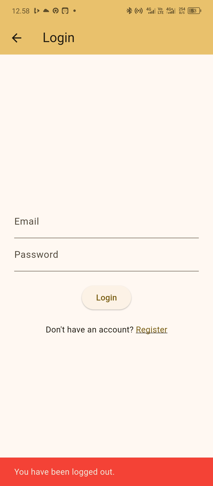
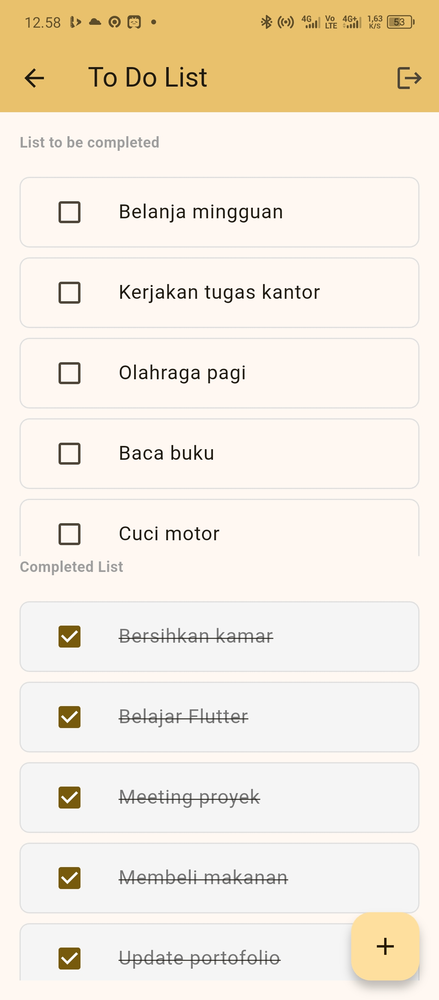
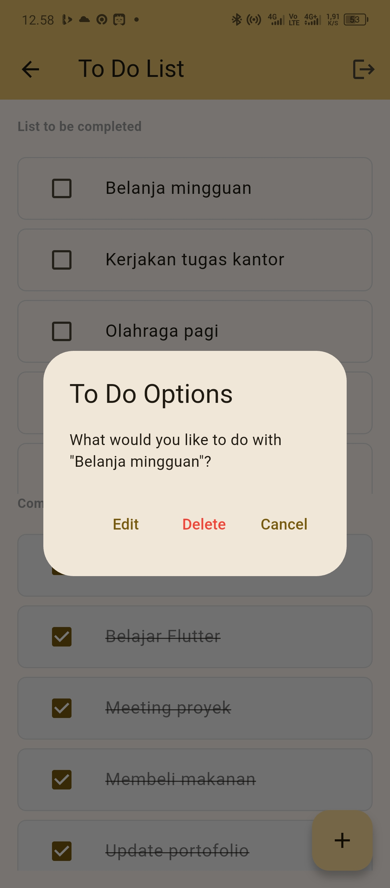

# 📝 Todo List Flutter App

A modern and feature-rich Todo List application built with Flutter, featuring Firebase authentication, push notifications, and local SQLite database management.

## ✨ Features

### 🔐 Authentication

- **Firebase Authentication** integration
- User registration and login
- Secure logout functionality
- Session management

### 📋 Todo Management

- ✅ Create new todo items
- ✏️ Edit existing todos
- ❌ Delete todos with confirmation
- ☑️ Mark todos as completed/incomplete
- 📱 Long press for quick actions (Edit/Delete)

### 🎨 User Interface

- **Modern Material Design** UI
- **Dual list view**: Pending and Completed todos
- **Visual feedback**:
  - Completed todos have strikethrough text
  - Grayed out background for completed items
  - Rounded borders for better aesthetics
- **Responsive design** for different screen sizes

### 🔔 Push Notifications

- **Firebase Cloud Messaging (FCM)** integration
- Real-time notification support
- Custom notification channels
- FCM token management

### 💾 Data Storage

- **SQLite** local database for offline functionality
- **Efficient data management** with CRUD operations
- **Auto-refresh** after data changes
- **Error handling** with user feedback

## 🛠️ Technologies Used

- **Flutter** - Cross-platform mobile development framework
- **Firebase Authentication** - User authentication and management
- **Firebase Cloud Messaging** - Push notifications
- **SQLite** (sqflite) - Local database storage
- **Material Design** - UI/UX design system

## 📱 Screenshots

<div align="center">

### Login & Authentication



### Todo Management



### Features Demo



</div>

## 🚀 Getting Started

### Prerequisites

- Flutter SDK (latest stable version)
- Android Studio / VS Code
- Firebase project setup
- Android device or emulator

### Installation

1. **Clone the repository**

   ```bash
   git clone https://github.com/feryanuar24/todolist_flutter.git
   cd todolist_flutter
   ```

2. **Install dependencies**

   ```bash
   flutter pub get
   ```

3. **Firebase Setup**

   - Create a new Firebase project at [Firebase Console](https://console.firebase.google.com/)
   - Add Android app to your Firebase project
   - Download `google-services.json` and place it in `android/app/`
   - Enable Authentication and Cloud Messaging in Firebase Console

4. **Configure Firebase**

   - Replace the existing `firebase_options.dart` with your configuration
   - Or run: `flutterfire configure`

5. **Run the app**
   ```bash
   flutter run
   ```

## 🏗️ Project Structure

```
lib/
├── models/
│   └── todo_model.dart          # Todo data model
├── screen/
│   └── todo/
│       └── index_screen.dart    # Main todo list screen
├── services/
│   └── db_helper.dart           # SQLite database helper
├── firebase_options.dart       # Firebase configuration
└── main.dart                   # App entry point
```

## 🗄️ Database Schema

### Todos Table

```sql
CREATE TABLE todos (
  id INTEGER PRIMARY KEY AUTOINCREMENT,
  title TEXT,
  isDone INTEGER  -- 0 for pending, 1 for completed
)
```

## 📋 API Reference

### DBHelper Methods

- `getTodos()` - Get all pending todos (isDone = 0)
- `getCompletedTodos()` - Get all completed todos (isDone = 1)
- `getTodoById(int id)` - Get specific todo by ID
- `insertTodo(Todo todo)` - Create new todo
- `updateTodo(Todo todo)` - Update existing todo
- `toggleTodoStatus(int id, bool isDone)` - Toggle completion status
- `deleteTodo(int id)` - Delete todo by ID

## 🔧 Configuration

### Android Permissions

The app requires the following permissions in `android/app/src/main/AndroidManifest.xml`:

```xml
<uses-permission android:name="android.permission.INTERNET" />
<uses-permission android:name="android.permission.POST_NOTIFICATIONS" />
```

### Firebase Configuration

Make sure your `android/app/src/main/AndroidManifest.xml` includes:

```xml
<meta-data
    android:name="com.google.firebase.messaging.default_notification_channel_id"
    android:value="default_channel" />
```

## 🚀 Features in Development

- [ ] Cloud synchronization
- [ ] Todo categories
- [ ] Due date reminders
- [ ] Priority levels
- [ ] Dark mode support
- [ ] Widget support

## 🐛 Known Issues

- None at the moment

## 🤝 Contributing

1. Fork the project
2. Create your feature branch (`git checkout -b feature/AmazingFeature`)
3. Commit your changes (`git commit -m 'Add some AmazingFeature'`)
4. Push to the branch (`git push origin feature/AmazingFeature`)
5. Open a Pull Request

## 📄 License

This project is licensed under the MIT License - see the [LICENSE](LICENSE) file for details.

## 🙏 Acknowledgments

- Flutter team for the amazing framework
- Firebase for authentication and messaging services
- SQLite for reliable local storage

## 📞 Contact

Fery Anuar - [feryanuar@gmail.com](mailto:feryanuar@gmail.com)

Project Link: [https://github.com/feryanuar24/todolist_flutter](https://github.com/feryanuar24/todolist_flutter)

---

⭐ Don't forget to star this repository if you found it helpful!
